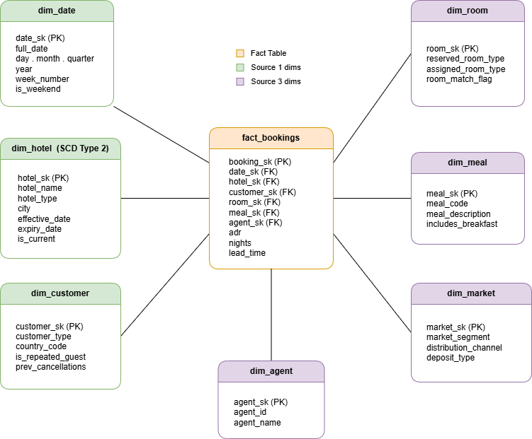
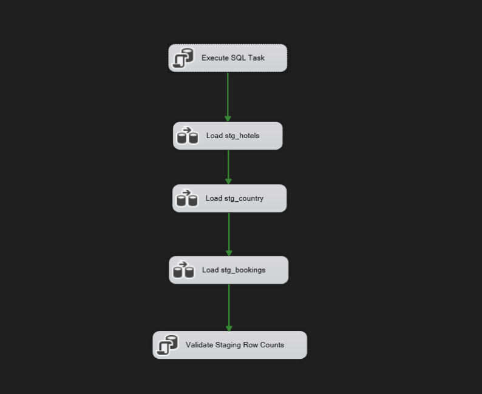
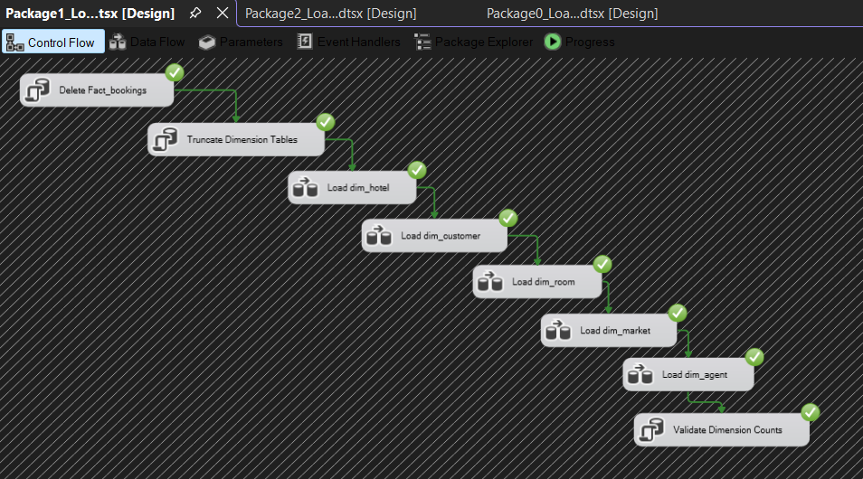
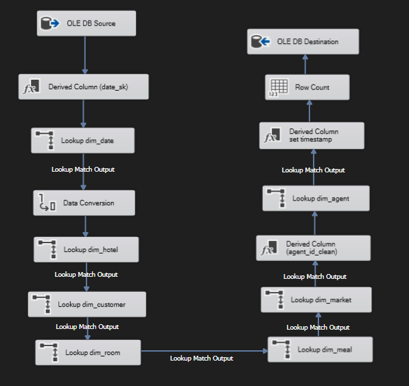
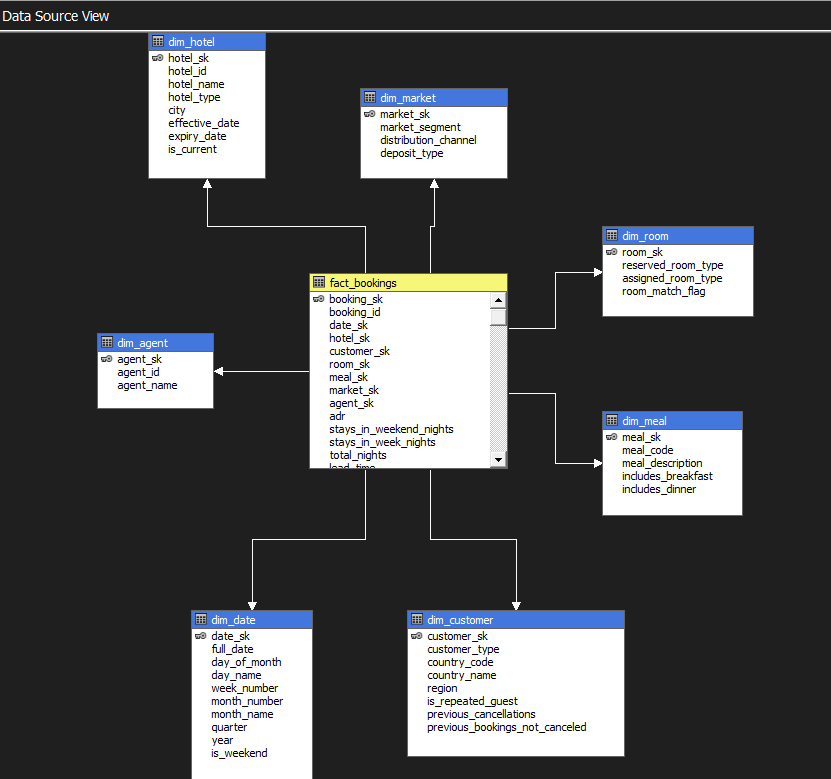
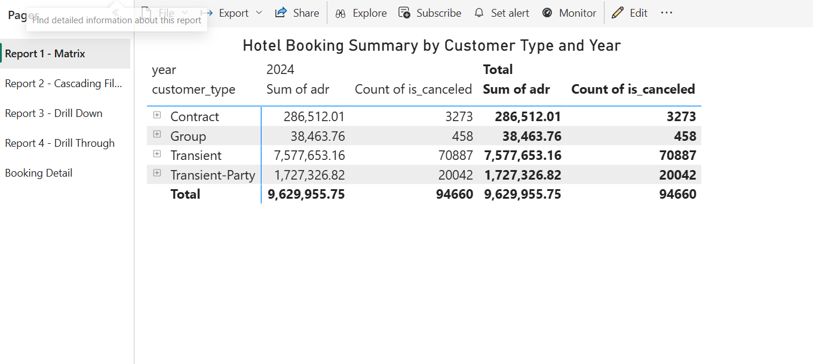
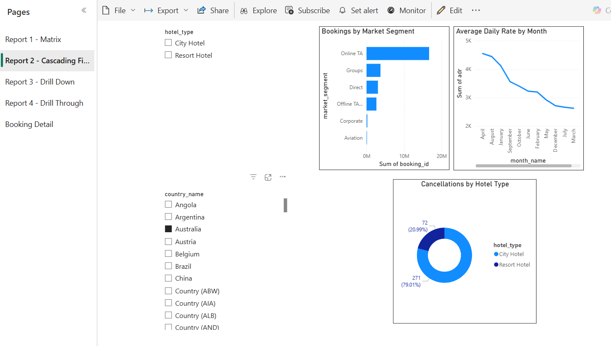
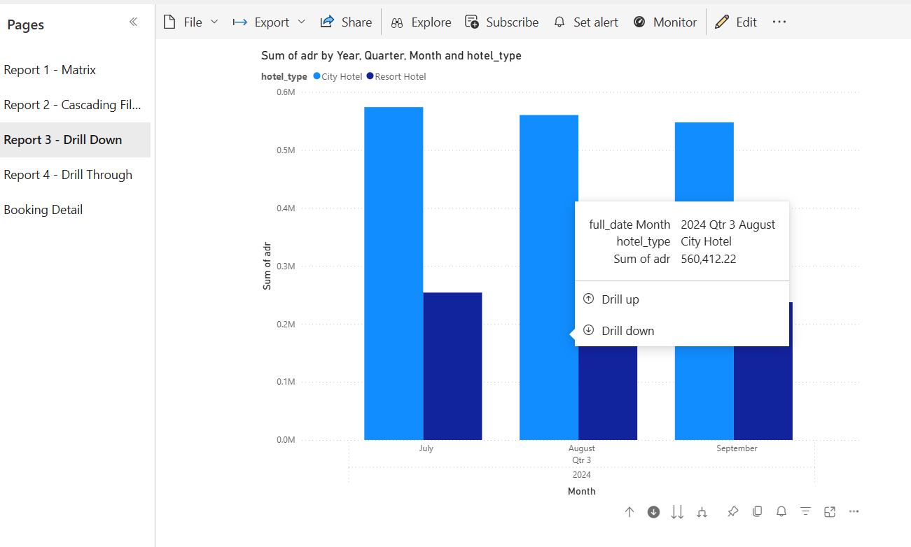
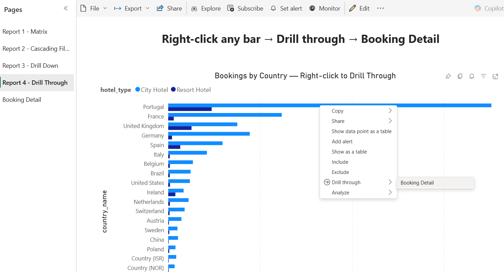

# Hotel Bookings — Data Warehouse & Business Intelligence

## Project Overview
A complete DWBI project built on the Hotel Bookings dataset 
(119,390 records) as part of IT3021 at SLIIT.

## Technologies Used
- **SQL Server** — Data Warehouse (Star Schema)
- **SSAS** — Multidimensional OLAP Cube
- **Excel** — OLAP Operations (Roll-up, Drill-down, Slice, Dice, Pivot)
- **Power BI** — Interactive Reports & Dashboards

## Data Warehouse Architecture
Star schema with:
- `FactBooking` — central fact table
- `DimDate` — date hierarchy (Year → Quarter → Month → Day)
- `DimCustomer` — customer & country info
- `DimHotel` — hotel type
- `DimRoom` — room & meal details
- `DimMarket` — market segment info

## 📊 Power BI Reports
| Report | Description |
|--------|-------------|
| Report 1 | Matrix visual — bookings by customer type & year |
| Report 2 | Cascading slicers — hotel → country filter with charts |
| Report 3 | Drill-down — Year → Quarter → Month → Day |
| Report 4 | Drill-through — country summary → booking detail |

## 🔷 OLAP Operations Demonstrated
- **Roll-up** — Month → Year aggregation
- **Drill-down** — Year → Month → Day
- **Slice** — Filter by single dimension (hotel type)
- **Dice** — Filter by multiple dimensions simultaneously
- **Pivot** — Rotate rows and columns

## 📁 Repository Structure
- `/CubeProject` — SSAS Visual Studio solution
- `/Excel` — Excel workbook with OLAP pivot tables
- `/PowerBI` — Power BI .pbix report file
- `/Documentation` — Full project report (PDF)

## 🔗 Power BI Live Report
[View Live Report] (https://app.powerbi.com/groups/me/reports/e9e9df43-8440-47ea-b3ea-70c1b85eefa9/81663d782d167e3ca030?experience=power-bi)

## 📷 Screenshots
| Star Schema                   | Staging                              | Load Dimentions                   |
| ---------------------------------- | -------------------------------------- | ------------------------------ |
|     |         | |

| Load Fact Table                    | Cube Structure                       | PowerBI Matrix Report                |
| ---------------------------------- | -------------------------------------- | ---------------------------------- |
|     |         |     |

| PowerBI Report with Cascading Filters                       | PowerBI report with Drill Down                        | PowerBI report with Drill Through |
| ---------------------------------- | -------------------------------------- | ---------------------------------- |
|     |         |     |

